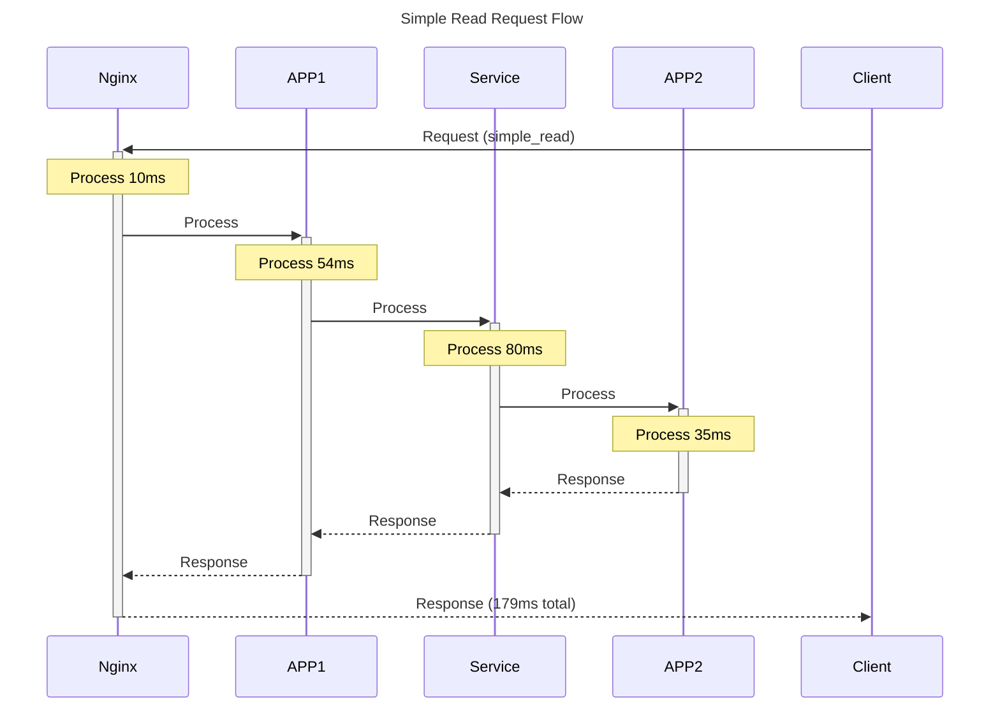
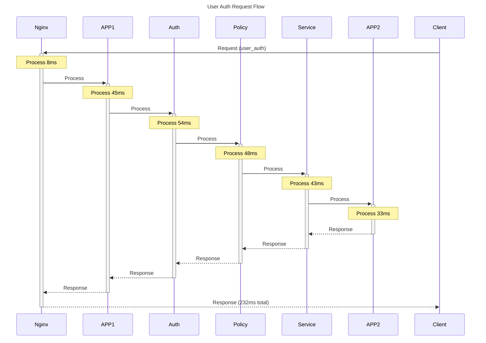
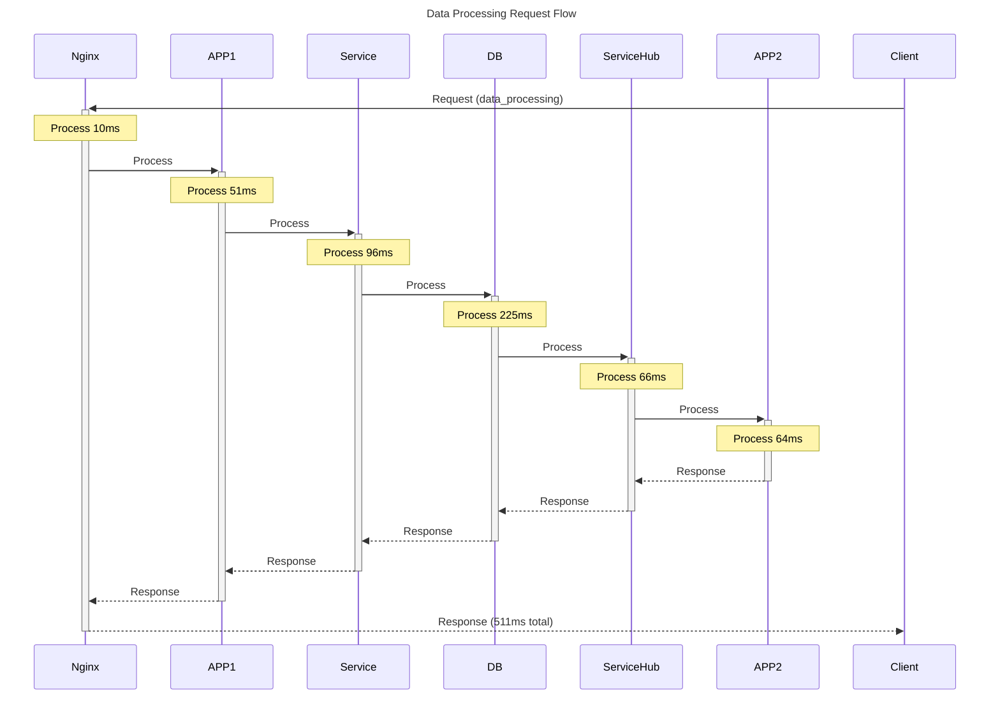
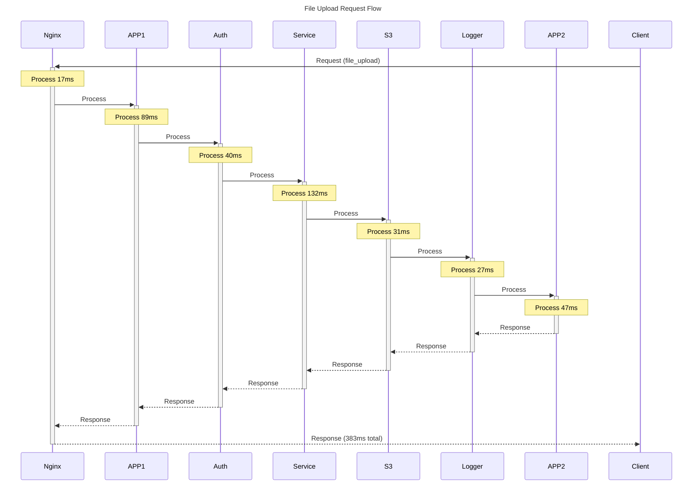
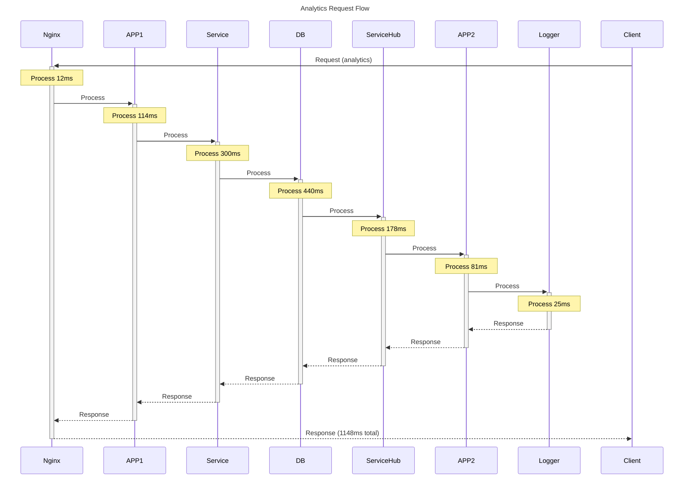
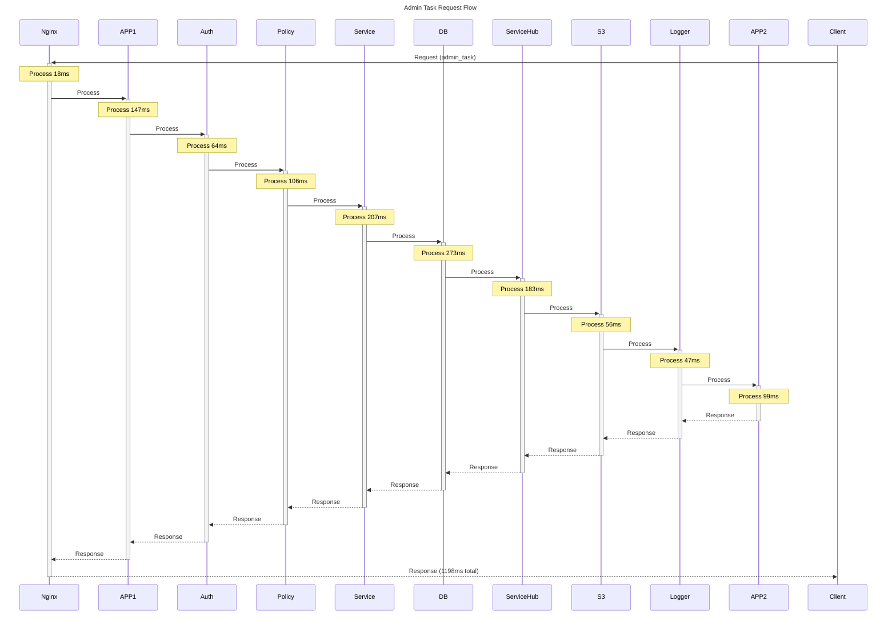
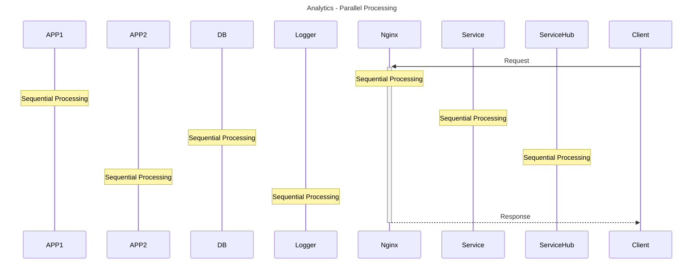
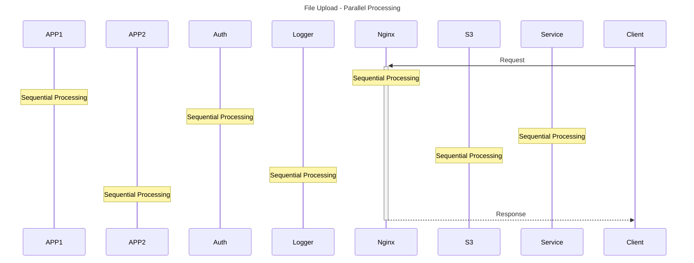

# Request Flow Sequence Diagrams

Auto-generated from execution traces.

## Simple Read Pattern



## User Auth Pattern



## Data Processing Pattern



## File Upload Pattern



## Analytics Pattern



## Admin Task Pattern



## Parallel Processing Examples

### User Auth Parallel Flow

```mermaid
sequenceDiagram
    title User Auth - Parallel Processing

    participant APP1
    participant APP2
    participant Auth
    participant Nginx
    participant Policy
    participant Service

    participant Client

    Client->>+Nginx: Request
    par Parallel Processing
        Processing on Nginx
        and Processing on APP1
    end
    Note over Auth: Sequential Processing
    Note over Policy: Sequential Processing
    Note over Service: Sequential Processing
    Note over APP2: Sequential Processing
    Nginx-->>-Client: Response
```

### Analytics Parallel Flow



### File Upload Parallel Flow



## Pattern Comparison

```mermaid
graph TD
    title Request Pattern Comparison

    Start0[simple_read]
    simple_read_0[Nginx]
    Start0 --> simple_read_0
    simple_read_1[APP1]
    simple_read_0 --> simple_read_1
    simple_read_2[Service]
    simple_read_1 --> simple_read_2
    simple_read_3[APP2]
    simple_read_2 --> simple_read_3
    End0[Response]
    simple_read_3 --> End0

    Start1[user_auth]
    user_auth_0[Nginx]
    Start1 --> user_auth_0
    user_auth_1[APP1]
    user_auth_0 --> user_auth_1
    user_auth_2[Auth]
    user_auth_1 --> user_auth_2
    user_auth_3[Policy]
    user_auth_2 --> user_auth_3
    user_auth_4[Service]
    user_auth_3 --> user_auth_4
    user_auth_5[APP2]
    user_auth_4 --> user_auth_5
    End1[Response]
    user_auth_5 --> End1

    Start2[data_processing]
    data_processing_0[Nginx]
    Start2 --> data_processing_0
    data_processing_1[APP1]
    data_processing_0 --> data_processing_1
    data_processing_2[Service]
    data_processing_1 --> data_processing_2
    data_processing_3[DB]
    data_processing_2 --> data_processing_3
    data_processing_4[ServiceHub]
    data_processing_3 --> data_processing_4
    data_processing_5[APP2]
    data_processing_4 --> data_processing_5
    End2[Response]
    data_processing_5 --> End2

    Start3[file_upload]
    file_upload_0[Nginx]
    Start3 --> file_upload_0
    file_upload_1[APP1]
    file_upload_0 --> file_upload_1
    file_upload_2[Auth]
    file_upload_1 --> file_upload_2
    file_upload_3[Service]
    file_upload_2 --> file_upload_3
    file_upload_4[S3]
    file_upload_3 --> file_upload_4
    file_upload_5[Logger]
    file_upload_4 --> file_upload_5
    file_upload_6[APP2]
    file_upload_5 --> file_upload_6
    End3[Response]
    file_upload_6 --> End3

    Start4[analytics]
    analytics_0[Nginx]
    Start4 --> analytics_0
    analytics_1[APP1]
    analytics_0 --> analytics_1
    analytics_2[Service]
    analytics_1 --> analytics_2
    analytics_3[DB]
    analytics_2 --> analytics_3
    analytics_4[ServiceHub]
    analytics_3 --> analytics_4
    analytics_5[APP2]
    analytics_4 --> analytics_5
    analytics_6[Logger]
    analytics_5 --> analytics_6
    End4[Response]
    analytics_6 --> End4

    Start5[admin_task]
    admin_task_0[Nginx]
    Start5 --> admin_task_0
    admin_task_1[APP1]
    admin_task_0 --> admin_task_1
    admin_task_2[Auth]
    admin_task_1 --> admin_task_2
    admin_task_3[Policy]
    admin_task_2 --> admin_task_3
    admin_task_4[Service]
    admin_task_3 --> admin_task_4
    admin_task_5[DB]
    admin_task_4 --> admin_task_5
    admin_task_6[ServiceHub]
    admin_task_5 --> admin_task_6
    admin_task_7[S3]
    admin_task_6 --> admin_task_7
    admin_task_8[Logger]
    admin_task_7 --> admin_task_8
    admin_task_9[APP2]
    admin_task_8 --> admin_task_9
    End5[Response]
    admin_task_9 --> End5

```

## Bottleneck Analysis

```mermaid
graph TD
    title System Bottlenecks Analysis

    Nginx[Nginx<br/>12.7ms]
    style Nginx fill:#99ff99
    APP1[APP1<br/>81.3ms]
    style APP1 fill:#99ff99
    Service[Service<br/>149.8ms]
    style Service fill:#ffcc99
    APP2[APP2<br/>58.2ms]
    style APP2 fill:#99ff99
    Auth[Auth<br/>55.0ms]
    style Auth fill:#99ff99
    Policy[Policy<br/>81.4ms]
    style Policy fill:#99ff99
    DB[DB<br/>304.7ms]
    style DB fill:#ff9999
    ServiceHub[ServiceHub<br/>146.0ms]
    style ServiceHub fill:#ffcc99
    S3[S3<br/>40.4ms]
    style S3 fill:#99ff99
    Logger[Logger<br/>30.9ms]
    style Logger fill:#99ff99

    classDef bottleneck fill:#ff9999,stroke:#ff0000
```
