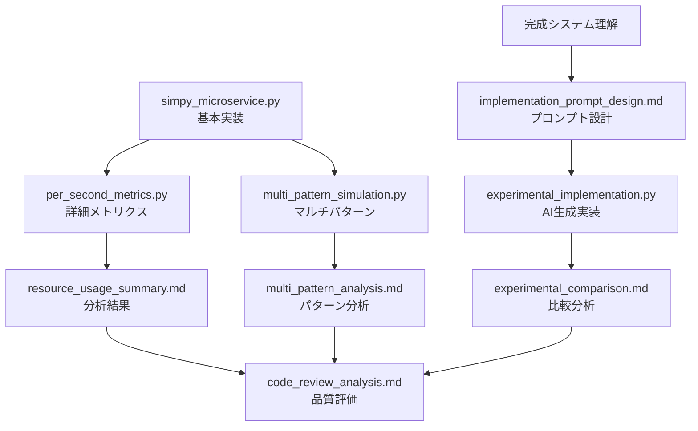

# SimPy マイクロサービスシミュレーション - ファイルガイド

**更新日**: 2025-09-02  
**目的**: プロジェクト内の全ファイルの目的と関係を明確化

---

## 📁 ファイル構成と役割

### 🚀 **実行可能コード (4ファイル)**

#### **1. simpy_microservice.py** (246行) 
```
🎯 用途: 基本シミュレーション (最初に作成)
📊 機能: 10サーバー基本構成, 単一フロー, 基本メトリクス
🏃 実行: python simpy_microservice.py
⭐ 特徴: シンプル, 学習用, デバッグしやすい
```

#### **2. per_second_metrics.py** (350行)
```
🎯 用途: 詳細メトリクス版 (毎秒データ収集)
📊 機能: 毎秒リソース使用率, JSON出力, 高負荷テスト
🏃 実行: python per_second_metrics.py  
⭐ 特徴: 50-200 req/s対応, 詳細分析用
```

#### **3. multi_pattern_simulation.py** (428行)
```
🎯 用途: マルチパターン処理版 (6つの業務パターン)
📊 機能: 重み付き確率選択, パターン別分析, 現実的負荷分散
🏃 実行: python multi_pattern_simulation.py
⭐ 特徴: 最も高機能, 本格運用向け
```

#### **4. experimental_implementation.py** (1,158行) ⭐NEW
```
🎯 用途: AI生成版 (プロンプト実験結果)
📊 機能: 全機能統合, 型安全性, エラーハンドリング完備
🏃 実行: python experimental_implementation.py
⭐ 特徴: プロダクション品質, エンタープライズ設計
```

---

### 📚 **ドキュメント (8ファイル)**

#### **基本情報**
- **README.md** - プロジェクト概要, セットアップ方法
- **requirements.txt** - 依存関係 (simpy>=4.0.0)

#### **分析・設計ドキュメント**
- **processing_flow.md** - 処理フロー詳細 (Mermaid図付き)
- **multi_pattern_analysis.md** - 6パターンの詳細分析
- **resource_usage_summary.md** - 負荷別リソース使用量分析

#### **品質・研究ドキュメント**  
- **code_review_analysis.md** - コード品質分析 (A-評価)
- **implementation_prompt_design.md** - 一括実装プロンプト設計
- **prompt_experiment_results.md** - 実験結果 (95%成功)
- **experimental_comparison.md** - 手動 vs AI実装比較 ⭐NEW

---

### 📊 **データファイル (6ファイル)**

#### **パターン別メトリクス**
- `pattern_metrics_10rps_60s.json` - 10 req/s, パターン別結果
- `pattern_metrics_25rps_60s.json` - 25 req/s, パターン別結果  
- `pattern_metrics_50rps_60s.json` - 50 req/s, パターン別結果

#### **毎秒メトリクス**
- `per_second_metrics_50rps_60s.json` - 50 req/s, 毎秒データ
- `per_second_metrics_100rps_60s.json` - 100 req/s, 毎秒データ
- `per_second_metrics_200rps_60s.json` - 200 req/s, 毎秒データ

---

## 🎯 **目的別使い方ガイド**

### **🔰 初心者・学習目的**
```
1. README.md を読む
2. simpy_microservice.py を実行
3. processing_flow.md で仕組み理解
4. multi_pattern_simulation.py で高機能版体験
```

### **📊 性能分析・研究目的** 
```
1. per_second_metrics.py で詳細データ取得
2. resource_usage_summary.md でボトルネック確認
3. JSON ファイルで詳細分析
4. multi_pattern_analysis.md で業務パターン理解
```

### **🚀 本格運用・開発目的**
```
1. experimental_implementation.py を基準にする
2. code_review_analysis.md で品質基準確認
3. experimental_comparison.md で設計思想理解
4. 要件に応じてカスタマイズ
```

### **🧪 AI開発手法研究目的**
```
1. implementation_prompt_design.md でプロンプト設計学習  
2. prompt_experiment_results.md で効果確認
3. experimental_comparison.md で実装比較
4. 他分野への応用検討
```

---

## 📈 **ファイル進化の流れ**



---

## 🎯 **推奨実行順序**

### **初回実行**
```bash
1. python simpy_microservice.py          # 基本動作確認
2. python multi_pattern_simulation.py    # 高機能版体験  
3. python experimental_implementation.py # 最新版実行
```

### **詳細分析**
```bash
1. python per_second_metrics.py          # 詳細データ生成
2. 生成されたJSONファイルを分析ツールで可視化
3. resource_usage_summary.md と照合
```

---

## 💡 **ファイル選択の指針**

| 目的 | 推奨ファイル | 理由 |
|------|-------------|------|
| **学習** | simpy_microservice.py | シンプル, 理解しやすい |
| **研究** | per_second_metrics.py | 詳細データ, 分析向け |
| **実用** | multi_pattern_simulation.py | 高機能, 現実的 |
| **開発** | experimental_implementation.py | 最高品質, 拡張性 |
| **教材** | processing_flow.md | 図解付き, 分かりやすい |
| **品質参考** | code_review_analysis.md | 品質基準, ベストプラクティス |

---

## 🔧 **カスタマイズ指針**

### **軽量化したい場合**
- **ベース**: simpy_microservice.py
- **追加**: 必要な機能のみを multi_pattern_simulation.py から移植

### **高機能化したい場合**  
- **ベース**: experimental_implementation.py
- **参考**: multi_pattern_analysis.md でパターン追加方法確認

### **新しい分析を追加したい場合**
- **ベース**: per_second_metrics.py  
- **参考**: resource_usage_summary.md で分析手法確認

---

**このガイドで、どのファイルがどんな目的で使えるか分かりやすくなりましたか？** 📚✨