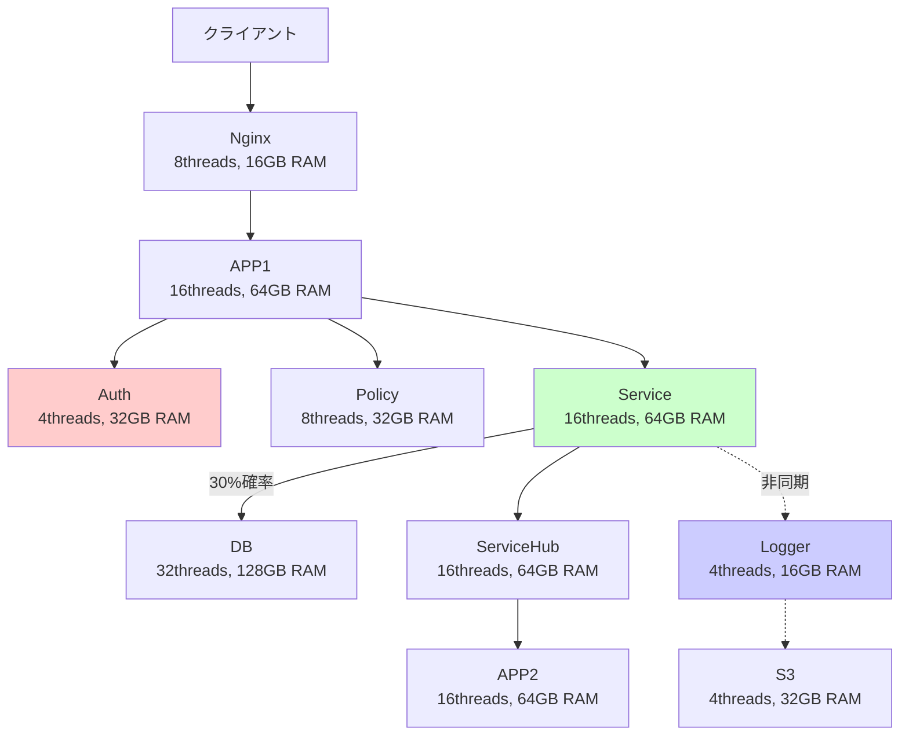

# SimPy マイクロサービス処理フロー

**概要**: SimPyを使用したマイクロサービスアーキテクチャの処理フローとリクエスト経路の詳細

---

## 🏗️ システム構成



---

## 🔄 メインリクエスト処理フロー

### **Phase 1: エントリーポイント**
```
1. Nginx処理
   ├── CPU: 10ms
   ├── Network: 1MB
   └── 役割: ロードバランシング、リクエスト振り分け
```

### **Phase 2: フロントエンド処理**
```
2. APP1処理
   ├── CPU: 60ms
   ├── RAM: 2GB確保
   └── 役割: 初期リクエスト処理、認証準備
```

### **Phase 3: 並列認証・認可処理** ⚡
```
3a. Auth処理 (並列)          3b. Policy処理 (並列)         3c. Service処理 (並列)
    ├── CPU: 40ms               ├── CPU: 30ms                ├── CPU: 80ms
    ├── RAM: 1GB                ├── RAM: 1GB                 ├── RAM: 2GB
    └── 必須：完了待ち           └── 必須：完了待ち            └── 独立：後で待機

    ↓ 同時実行 ↓               ↓ 同時実行 ↓                ↓ 条件分岐 ↓
    
Auth/Policy完了まで待機                                   30%確率でDB呼び出し
system.env.all_of([auth_task, policy_task])              ├── CPU: 120ms
                                                         ├── RAM: 4GB  
                                                         ├── Disk: 50MB
                                                         └── Network: 2MB
```

### **Phase 4: サービス完了待ち**
```
4. Service処理完了待ち
   └── yield service_task
       ├── Serviceのみの処理完了
       └── DB処理（実行された場合）完了
```

### **Phase 5: 非同期ログ処理開始** 🔄
```
5. 非同期ログ開始（メイン処理に影響しない）
   system.env.process(logger_to_s3_flow(system))
   
   5a. Logger処理              5b. S3処理
       ├── CPU: 20ms               ├── CPU: 10ms
       ├── RAM: 1GB                ├── RAM: 2GB
       └── 非同期実行              ├── Disk: 100MB
                                   ├── Network: 20MB
                                   └── 非同期実行
```

### **Phase 6: バックエンド処理**
```
6. ServiceHub処理
   ├── CPU: 50ms
   ├── RAM: 1GB
   └── 役割: サービス統合、データ集約
```

### **Phase 7: 最終処理**
```
7. APP2最終処理
   ├── CPU: 40ms
   ├── RAM: 2GB
   ├── 役割: レスポンス整形、最終検証
   └── 完了：クライアントへレスポンス
```

---

## ⚡ 並列処理の詳細

### **同期並列処理（Phase 3）**
```python
# 3つの処理を同時開始
auth_task = system.env.process(system.auth.process_request(cpu_ms=40, ram_gb=1))
policy_task = system.env.process(system.policy.process_request(cpu_ms=30, ram_gb=1))
service_task = system.env.process(service_with_db_flow(system))

# Auth/Policy完了まで待機（必須）
yield system.env.all_of([auth_task, policy_task])

# Service完了待ち（独立）
yield service_task
```

**効果**:
- Auth(40ms) + Policy(30ms) = 最大40msで完了（逐次なら70ms）
- **時間短縮**: 約43%の処理時間削減

### **非同期処理（Phase 5）**
```python
# メイン処理に影響させずにログ処理開始
system.env.process(logger_to_s3_flow(system))
# ↑ yield しない = 待機しない
```

**効果**:
- Logger(20ms) + S3(10ms + Disk/Network) がメイン処理時間に加算されない
- **レスポンス時間**: ログ処理分（~100ms）の短縮

---

## 🎯 条件分岐処理

### **Service → DB 呼び出し（30%確率）**
```python
def service_with_db_flow(system):
    # Service処理（必須）
    yield system.env.process(system.service.process_request(cpu_ms=80, ram_gb=2))
    
    # 30%の確率でDB必要
    if random.random() < 0.3:
        yield system.env.process(system.db.process_request(
            cpu_ms=120, ram_gb=4, disk_mb=50, net_mb=2
        ))
```

**実行パターン**:
- **70%のリクエスト**: Service処理のみ（80ms）
- **30%のリクエスト**: Service + DB処理（80ms + 120ms + Disk/Network）

---

## ⏱️ タイミング図

```
時間軸 →  0ms    50ms   100ms  150ms  200ms  250ms  300ms  350ms
         ├────┼────┼────┼────┼────┼────┼────┼────┤

Nginx    [■■]
         └─→ APP1    [■■■■■■]
                     └─→ Auth     [■■■■] ←┐
                     └─→ Policy   [■■■]   │ 並列実行
                     └─→ Service  [■■■■■■■■] ←┘
                                 └─→ DB (30%) [■■■■■■■■■■■]
                                           └─→ ServiceHub [■■■■■]
                                                      └─→ APP2 [■■■■]

Logger   (非同期)                 [■■] ──→ S3 [■■■■■■■■■]

━━━━━━━━━━━━━━━━━━━━━━━━━━━━━━━━━━━━━━━━━━━━━━━━━━━━━
メイン処理時間: ~250-350ms (DBアクセス有無による)
ログ処理時間: メイン処理に影響せず（非同期）
```

---

## 📊 リソース消費パターン

### **CPU使用量（リクエスト当たり）**
| サーバー | CPU時間 | 使用率計算 | 備考 |
|---------|---------|-----------|------|
| Nginx | 10ms | 低負荷 | ネットワーク処理メイン |
| APP1 | 60ms | 中負荷 | フロントエンド処理 |
| Auth | 40ms | **高負荷** | 4スレッドでボトルネック |
| Policy | 30ms | 中負荷 | 8スレッドで処理 |
| Service | 80ms | 中負荷 | 16スレッドで分散 |
| DB | 120ms (30%確率) | 中負荷 | 32スレッドで高性能 |
| ServiceHub | 50ms | 中負荷 | バックエンド処理 |
| APP2 | 40ms | 中負荷 | 最終処理 |

### **メモリ使用パターン**
```
リクエスト開始時:
├── APP1: 2GB確保
├── Auth: 1GB確保  
├── Policy: 1GB確保
└── Service: 2GB確保
    └── DB (30%): 4GB確保

非同期処理:
├── Logger: 1GB確保
└── S3: 2GB確保

最終処理:
├── ServiceHub: 1GB確保  
└── APP2: 2GB確保
```

---

## 🚨 ボトルネック分析

### **1. Authサーバー（最大の問題）**
```
問題: 4スレッド × 40ms/リクエスト = 100ms周期で4リクエスト処理
理論限界: 4 × (1000ms / 40ms) = 100 req/s
実測値: ~100 req/sで99%CPU使用率

対策: threads 4→16 でスループット4倍向上
```

### **2. S3サーバー（RAM不足）**
```
問題: 32GB RAM × 非同期大量処理 = メモリ不足
現象: 全負荷レベルで100%RAM使用率
影響: ログ処理遅延、メモリスワップ

対策: ram_gb 32→128 で余裕確保
```

### **3. Service + DB（条件分岐の影響）**
```
Service単体: 80ms処理
Service + DB: 80ms + 120ms + Disk/Network = ~250ms処理

30%確率でレスポンス時間が3倍に延長
高負荷時にDB待ちキューが発生

対策: DBコネクションプール、キャッシュ導入
```

---

## 💡 最適化提案

### **短期対策（即座に実装可能）**
1. **Auth強化**: `threads=4` → `threads=16`, `ram_gb=32` → `ram_gb=64`
2. **S3強化**: `ram_gb=32` → `ram_gb=128`  
3. **Service調整**: DB接続最適化、タイムアウト設定

### **中期対策（アーキテクチャ改善）**
1. **Auth分散**: 複数Authサーバーでロードバランシング
2. **非同期処理改善**: ログ処理のバッチ化、キューイング
3. **DB最適化**: レプリケーション、キャッシュ層追加

### **長期対策（システム再設計）**
1. **マイクロサービス分割**: Service機能の細分化
2. **イベント駆動**: 完全非同期アーキテクチャへ移行
3. **スケーラビリティ**: 動的スケーリング対応

---

**関連ファイル**:
- `simpy_microservice.py` - メイン処理フロー実装
- `per_second_metrics.py` - 詳細メトリクス収集
- `resource_usage_summary.md` - 性能分析結果